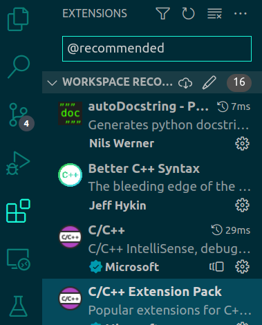

# vscode_extensions
this repository is used for sharing Python and C++ code styles.

## How to use
```

#### 2. execute bash script in scripts
- Note that running the script will overwrite .vscode/extensions.json and .vscode/setting.json.
```sh
chmod +x setup_extension.sh
bash ./setup_extension.sh
```

#### 3. specify workspace path that you want to setting
After executing the bash script, specify the path according to the following log:
```sh
----------------------------
input path for setup workspace
~/{YOUR_WORKSPACE}
```

#### 4. open vscode in your workspace
#### 5. install recommend extension
- 1. click "Extensions" on left.
- 2. input "@recommended".
- 3. slect Cloud icon.



